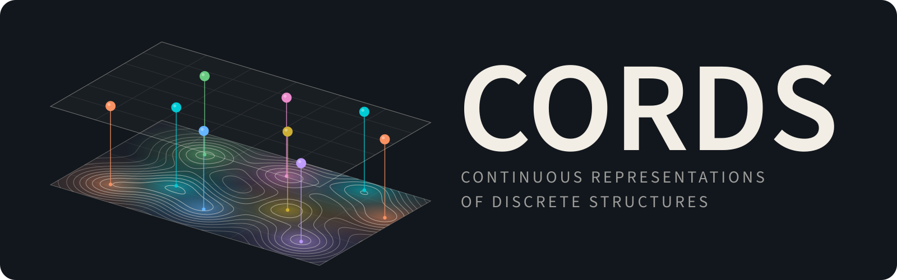
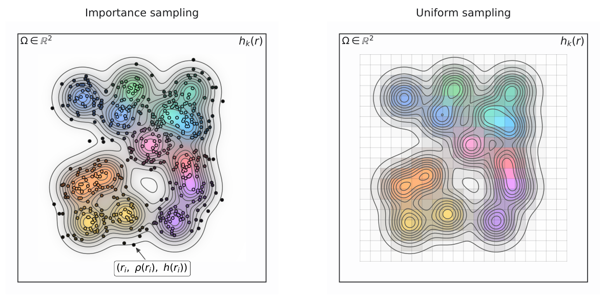

> [!WARNING]
> **Beta release.** This repository provides a minimal implementation accompanying
> [**CORDS: Continuous Representations of Discrete Structures**](https://arxiv.org/abs/2601.21583) (ICLR 2026).
> It includes the core field representation, reconstruction tools, and introductory
> notebooks. Training and generation examples remain experimental.
>
> For questions about the paper or this implementation, please contact
> Tin Hadži Veljković at [tin.hadzi@gmail.com](mailto:tin.hadzi@gmail.com).

<div align="center">



<br>

Code and notebooks accompanying the **ICLR 2026** paper.

Tin Hadži Veljković · Erik Bekkers · Michael Tiemann · Jan-Willem van de Meent

[](https://arxiv.org/abs/2601.21583)

[Paper](https://arxiv.org/abs/2601.21583) · [Molecular notebook](notebooks/01_molecules.ipynb) · [Detection notebook](notebooks/02_mnist_detection.ipynb)

</div>

CORDS represents a set of spatial objects as continuous fields. A density field
encodes where the objects are and how many there are, while feature fields carry
attributes such as atom types, digit classes, or bounding-box dimensions. This
lets a model predict or generate fields and then reconstruct a discrete set,
including its size.

This repository contains a minimal implementation of the representation,
reconstruction tools, and examples for molecules and MNIST object detection.
The notebooks introduce the equations, visualize roundtrips from sets to fields
and back, and demonstrate how to train models in field space.

## How CORDS works

Consider a set of objects with positions $\mathbf r_i\in\mathbb R^d$ and attributes
$\mathbf x_i\in\mathbb R^c$. We place a unit-integral Gaussian kernel
$\kappa_\sigma$ at each position and construct two fields:

$$
\rho(\mathbf r)=\sum_{i=1}^{N}\kappa_\sigma(\mathbf r-\mathbf r_i),
\qquad
\mathbf h(\mathbf r)=\sum_{i=1}^{N}\kappa_\sigma(\mathbf r-\mathbf r_i)\,\mathbf x_i.
$$

Here $\kappa_\sigma(\mathbf r)=(2\pi\sigma^2)^{-d/2}\exp(-\|\mathbf r\|^2/(2\sigma^2))$.
The sums are independent of object ordering, and each object contributes one
unit of density mass:

$$
N=\int_{\mathbb R^d}\rho(\mathbf r)\,d\mathbf r.
$$

The same representation therefore accommodates different set sizes. A model
operating on the fields can learn object count through density mass, together
with positions and attributes.

To reconstruct a set, we estimate its count from the density integral, fit that
many kernel centers to the density, and recover the attributes jointly from the
feature fields. At sampled locations, let $A_{si}=\kappa_\sigma(\mathbf r_s-\widehat{\mathbf r}_i)$,
let $H$ contain the sampled feature values, and let $W$ contain the integration
weights. Feature recovery becomes a regularized linear solve:

$$
\left(A^\top W A+\lambda I\right)\widehat X=A^\top W H.
$$

The paper establishes invertibility under its kernel and distinct-center
assumptions. In practice, finite sampling, overlapping kernels, and imperfect
model predictions affect reconstruction accuracy; the notebooks measure position
and attribute errors alongside field-fitting residuals.

## Sampling the fields

A continuous field is evaluated at a finite number of locations before being
passed to a model. Regular grids suit images, while importance sampling is useful
for molecules because it concentrates evaluations around the atoms in 3D space.

<p align="center">
  
</p>

**Figure 2 from the paper.** Importance sampling allocates evaluations according
to the density; uniform sampling evaluates the fields across a regular grid.
Both produce coordinates paired with density and feature values.

For the molecular roundtrips, we draw $M$ points from the mixture proposal
$q(\mathbf r)=\rho(\mathbf r)/N$. The stored quadrature weights account for this
nonuniform sampling:

$$
w_s=\frac{1}{M\,q(\mathbf r_s)},
\qquad
\widehat N=\sum_{s=1}^{M}w_s\rho(\mathbf r_s).
$$

For this exact proposal, $\rho/q=N$, so the estimated count is exact up to
floating-point arithmetic. The molecular training example uses a separate
count-normalized density convention for generated fields, whose source proposal
is unknown. The [molecular notebook](notebooks/01_molecules.ipynb) explains both
conventions and their decoding procedures.

## Getting started

Use Python 3.10 or newer with PyTorch 2.2 or newer. From the repository root,
install the dependencies and open the notebooks:

```bash
python -m pip install -r requirements.txt
python -m jupyter lab notebooks/
```

The code runs directly from the checkout. The molecular architecture and its
tree operations are implemented locally in PyTorch.

| Notebook | Contents |
| --- | --- |
| [Molecular representations](notebooks/01_molecules.ipynb) | QM9 structures, importance-sampled fields, custom fixed-bandwidth GMM reconstruction, interactive 3D views, and molecular denoising |
| [Object detection](notebooks/02_mnist_detection.ipynb) | MNIST images and boxes, density/class/size fields, reconstruction with overlapping objects, and image-to-field training |

Select the appropriate Python kernel and run the cells in order. The default
`RUN_TRAINING = False` setting runs the roundtrips on CPU. Set it to `True` to
also run the small training example in each notebook; training can use a GPU
when available. Static figures are included for viewing on GitHub, alongside
interactive controls for JupyterLab.

Three QM9 structures and 100 MNIST glyphs are bundled, so the examples need no
dataset downloads. Their identifiers and extraction procedure are documented
in [data sources](cords/data/README.md).

### A molecular roundtrip

Run this from the repository root:

```python
from cords import CORDSTransform
from cords.molecules import load_qm9_examples, reconstruction_metrics

molecule = load_qm9_examples()[0]
transform = CORDSTransform(sigma=0.2, seed=0)  # Gaussian width in angstroms

fields = transform.encode(
    molecule.positions, molecule.features, num_samples=1024
)
recovered = transform.decode(fields)

print(reconstruction_metrics(molecule, recovered))
```

`fields` stores sampled coordinates, density, feature values, and integration
weights. The decoder recovers atom count, positions, and element labels from
these fields. Molecular initialization uses a custom fixed-bandwidth GMM,
followed by density fitting and feature recovery. The notebook also visualizes
the source structure and reconstructed atoms together.

## Training and sampling

`CORDSMoleculeDenoiser` uses the Erwin tree-attention architecture with RFF/FiLM
field fusion and a joint EDM denoising objective. `CORDSDetector` uses a compact
ConvNeXt/FPN network to predict density, class, and box-size fields from images.
The models retain their [source attribution](THIRD_PARTY.md).

The supplied configurations train on small fixed batches to demonstrate the
learning procedure:

```bash
python -m cords.train qm9 --config configs/qm9_overfit.json \
  --steps 100 --device cpu --output runs/qm9

python -m cords.train mnist --config configs/mnist_overfit.json \
  --steps 100 --device cpu --output runs/mnist
```

Each run saves a checkpoint, configuration, and training metrics. Use
`--device cuda` for GPU training. To resume a molecular run and sample fields
from its checkpoint:

```bash
python -m cords.train qm9 --resume runs/qm9/checkpoint.pt \
  --steps 200 --output runs/qm9

python -m cords.sample --checkpoint runs/qm9/checkpoint.pt \
  --output runs/sampled_fields.pt --seed 0 --decode
```

`--steps` is the total training target when resuming. Sampling uses a Karras
noise schedule with second-order Heun updates. These short training examples
illustrate the workflow; meaningful molecular generation or detection evaluation
requires larger training experiments and held-out data. An undertrained model
may produce fields that cannot be decoded reliably, and decoding failures are
recorded in the sample output.

For training on changing batches from a larger local dataset, add
`--full-data --data PATH`. QM9 accepts JSON matching the
[bundled structure records](cords/data/qm9_examples.json), or a trusted raw QM9
`.pt` cache. MNIST accepts an NPZ archive containing uint8 `images` with shape
`[N, 28, 28]`, integer `labels`, and `source_indices`; the scene generator composes
new scenes from these glyphs. The repository focuses on these two applications;
see the [paper](https://arxiv.org/abs/2601.21583) for the full set of experiments.

## Repository layout

```text
cords/          field transforms, reconstruction, models, and visualization
notebooks/      molecular and detection examples with optional training
configs/        small training configurations
tests/          numerical roundtrips, models, data generation, and checkpointing
docs/           provenance, validation results, and figures
scripts/        fixture preparation and notebook execution
```

To check the implementation and execute both notebooks:

```bash
python -m pytest -q
python scripts/execute_notebooks.py
```

See [validation](docs/validation.md) for measured results and numerical
limitations, and [implementation provenance](docs/provenance.md) for the
relationship to the original experiments.

## Citation

If you use CORDS, please cite the paper:

```bibtex
@article{hadziveljkovic2026cords,
  title   = {{CORDS}: Continuous Representations of Discrete Structures},
  author  = {Had{\v{z}}i Veljkovi{\'c}, Tin and Bekkers, Erik and
             Tiemann, Michael and van de Meent, Jan-Willem},
  journal = {arXiv preprint arXiv:2601.21583},
  year    = {2026},
  doi     = {10.48550/arXiv.2601.21583},
  url     = {https://arxiv.org/abs/2601.21583}
}
```

GitHub's **Cite this repository** menu also provides a citation through
[CITATION.cff](CITATION.cff).
